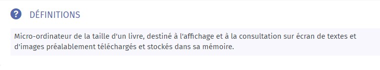

# Définition

LAROUSSE. "Définitions : liseuse" [en ligne].In _Larousse_. [consulté le 11 mai 2020]. Disponible sur le web: <https://www.larousse.fr/dictionnaires/francais/liseuse/47389#definition>

