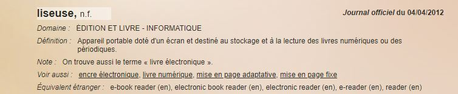

# Définition
## La liseuse
LAROUSSE. "Liseuse : définition" [en ligne].In _Larousse_. [consulté le 11 mai 2020]. Disponible sur le Web: <https://www.larousse.fr/dictionnaires/francais/liseuse/47389#definition>

FRANCETERME. "Liseuse" [en ligne]. In _FranceTerme_. 4 avril 2012 [consulté le 11 mai 2020]. Disponible sur le Web: <http://www.culture.fr/franceterme/terme/COGE783>

