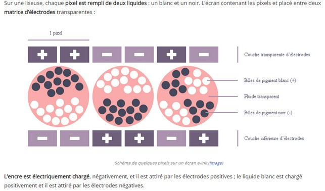
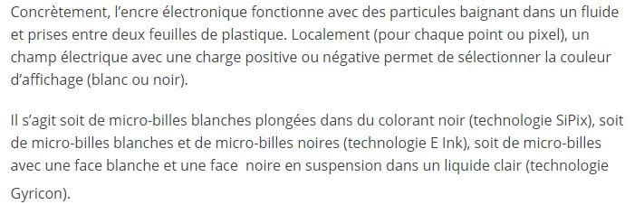
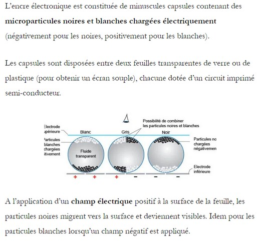

# Comment cela fonctionne ?

## L'encre électronique (E-Ink)
VAN NEERDEN, Timo. "L'encre électronique "e-Ink" : l'affichage électrophorétique" [en ligne]. In _Couleur Science_. 6 décembre 2014 [consulté le 18 mai 2020]. Disponible sur le Web : <https://couleur-science.eu/?d=7c4944--lencre-electronique-e-ink-laffichage-electrophoretique>

Web

Web

