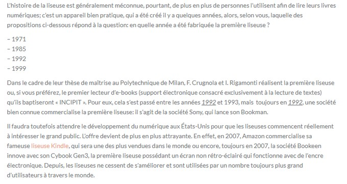
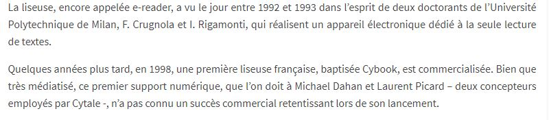

# Historique
Quiz Culture Générale. " Histoire de la liseuse, en quelle année a été fabriquée la première liseuse ? " [en ligne]. In _Quiz Culture Générale_. 20 juin 2015 [consulté le 18 mai 2020]. Disponible sur le Web : <https://www.rechercher.club/histoire-de-la-liseuse-en-quelle-annee-a-ete-fabrique-la-premiere-liseuse/>

MICHAUX, Stéphanie. " Historique et avenir de la liseuse " [en ligne]. In _Lettres Numériques_. 08 février 2013 [consulté le 18 mai 2020]. Disponible sur le Web : <http://www.lettresnumeriques.be/2013/02/08/historique-et-avenir-de-la-liseuse/>

