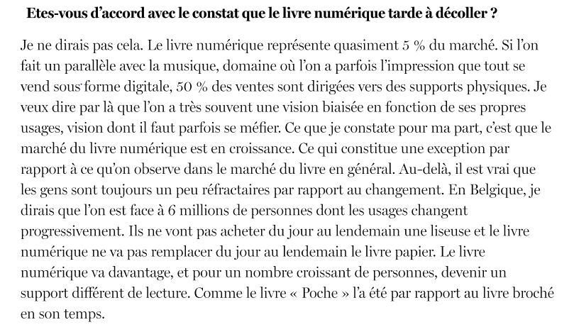
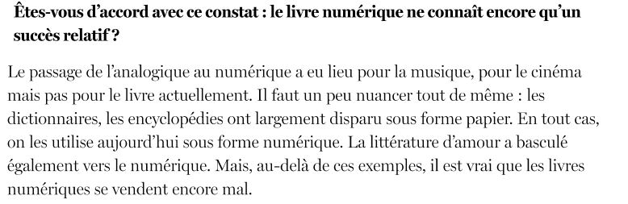
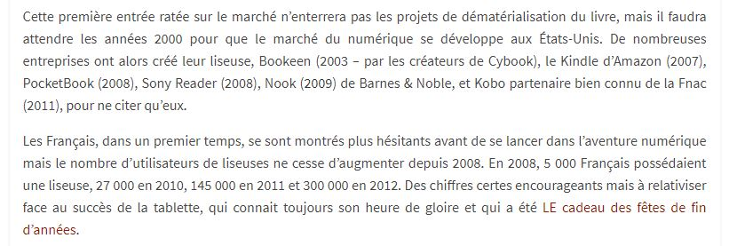
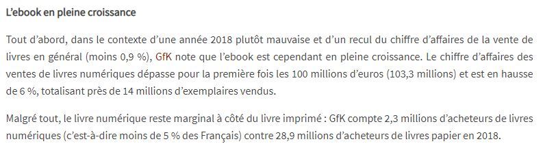

# Le succès de la liseuse et des livres numériques

MICHAUX, Stéphanie. " Historique et avenir de la liseuse " [en ligne]. In _Lettres Numériques_. 08 février 2013 [consulté le 18 mai 2020]. Disponible sur le Web : <http://www.lettresnumeriques.be/2013/02/08/historique-et-avenir-de-la-liseuse/>

VOOS, Audrey. " Les chiffres du livres numériques en France : étude GfK et 9e baromètre Sofia/SNE/SGDL " [en ligne]. In _Lettres numériques_. 22 mars 2019 [consulté le 30 mai 2020]. Disponible sur le Web : <http://www.lettresnumeriques.be/2019/03/22/les-chiffres-du-livre-numerique-en-france-etude-gfk-et-9ebarometre-sofiasnesgdl/>

