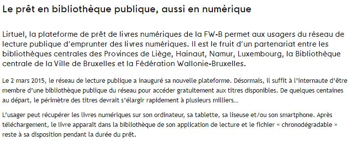
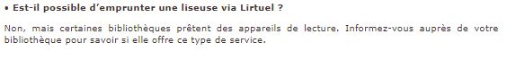

# Le succès de la liseuse et des livres numériques

## Leur succès en général
MICHAUX, Stéphanie. " Historique et avenir de la liseuse " [en ligne]. In _Lettres Numériques_. 08 février 2013 [consulté le 18 mai 2020]. Disponible sur le Web : <http://www.lettresnumeriques.be/2013/02/08/historique-et-avenir-de-la-liseuse/>

VOOS, Audrey. " Les chiffres du livres numériques en France : étude GfK et 9e baromètre Sofia/SNE/SGDL " [en ligne]. In _Lettres numériques_. 22 mars 2019 [consulté le 30 mai 2020]. Disponible sur le Web : <http://www.lettresnumeriques.be/2019/03/22/les-chiffres-du-livre-numerique-en-france-etude-gfk-et-9ebarometre-sofiasnesgdl/>

## Le prêt en bibliothèque

Fédération Wallonie-Bruxelles. " Le prêt en bibliothèque publique, mais aussi en numérique " [en ligne]. In _Fédération Wallonie-Bruxelles_. 7 août 2015 [consulté le 30 mai 2020]. Disponible sur le Web : <http://www.federation-wallonie-bruxelles.be/index.php?id=detail_article&no_cache=1&tx_cfwbarticlefe_cfwbarticlefront%5Baction%5D=show&tx_cfwbarticlefe_cfwbarticlefront%5Bcontroller%5D=Document&tx_cfwbarticlefe_cfwbarticlefront%5Bpublication%5D=964&cHash=c1a49278999ea1e89622402808b04533> 

Fédération Wallonie-Bruxelles. " Lirtuel - Modalités d'inscription et de prêt " [en ligne]. In _Fédération Wallonie-Bruxelles_. s.d. [consulté le 30 mai 2020]. Disponible sur le Web : <http://www.bibliotheques.be/index.php?id=16129>

